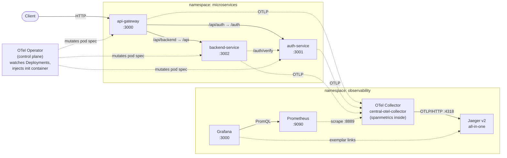

# Trace-Derived RED Metrics with the OpenTelemetry SpanMetrics Connector

_Generate Request / Error / Duration metrics directly from your distributed traces — one instrumentation pipeline, two telemetry signals._


## Why this matters

RED metrics — request **R**ate, **E**rror rate, request **D**uration — are the foundation of service-level monitoring; they are the numbers your dashboards, SLOs, and pages are built on. The conventional way to get them is a Prometheus client library embedded in every service, with histogram timers wrapped around every HTTP handler. But if you are also tracing (and you should be), that means *two* instrumentation pipelines per service — the tracing SDK and the metrics SDK — each with its own dependencies, its own conventions, and its own drift over time. Two libraries to keep patched. Two adoption hurdles to clear in every new service.

Here is the thing: every server span your tracing SDK already emits contains everything RED needs. A span carries the service name, the route, the duration, and the status code — a span *is* a request observation. Instrumenting metrics separately means doing the same arithmetic in two places and hoping the answers agree.

The OTel Collector's [`spanmetrics` connector](https://github.com/open-telemetry/opentelemetry-collector-contrib/tree/main/connector/spanmetricsconnector) closes that gap. It sits between two pipelines inside the collector and derives RED metrics from the trace stream in-flight: spans go in one OTLP pipeline; counters and histograms come out the other side, labelled by dimensions you choose (service, HTTP method, status code) and scraped by Prometheus. One auto-instrumentation, two telemetry signals, one source of truth. This repo builds that pipeline end to end on the same zero-code-instrumented workload as [otel-zero-code-instrumentation-k8s](https://github.com/ashok-m-sudo/otel-zero-code-instrumentation-k8s), and finishes with a Grafana RED dashboard whose every data point was once a span.

## Architecture



Inside the collector node above are **three pipelines** that mermaid can't draw: spans arrive once over OTLP and fan out into a `traces` pipeline (noise-filtered, batched, exported to Jaeger at full fidelity) and a `traces/to_metrics` pipeline (additionally filtered down to server spans only, feeding the **spanmetrics connector**). The connector converts those spans into counters and histograms, which the third pipeline — `metrics` — batches and exposes on the Prometheus exporter at `:8889` for scraping. One OTLP input, two telemetry signals out; see [docs/architecture.md](docs/architecture.md) for the full rationale.

## Prerequisites

- A running **Kubernetes** cluster (v1.27+ recommended) and `kubectl` configured to reach it.
- **`bash`** available locally to run the helper scripts in `manifests/`.
- The sample workload from **[node-microservice-template](https://github.com/ashok-m-sudo/node-microservice-template)** already deployed to the `microservices` namespace (Deployments: `api-gateway`, `auth-service`, `backend-service`).
- This repo deploys its **own complete observability stack** (operator, collector, Jaeger, Prometheus, Grafana) — it does **not** require [otel-zero-code-instrumentation-k8s](https://github.com/ashok-m-sudo/otel-zero-code-instrumentation-k8s) to be installed first.

## Quickstart

Each step below is a one-line summary; full commands and explanations live in **[docs/deployment-guide.md](docs/deployment-guide.md)**.

1. **Create the `observability` namespace** — `kubectl apply -f manifests/00-namespace.yaml`. ([guide](docs/deployment-guide.md#1-create-the-observability-namespace))
2. **Install cert-manager** (provides the webhook TLS certs the operator needs) — `bash manifests/01-install-cert-manager.sh`. ([guide](docs/deployment-guide.md#2-install-cert-manager))
3. **Install the OpenTelemetry Operator** — `bash manifests/02-install-otel-operator.sh`. ([guide](docs/deployment-guide.md#3-install-the-opentelemetry-operator))
4. **Deploy Jaeger v2 all-in-one** — `kubectl apply -f manifests/04-jaeger-all-in-one.yaml`. ([guide](docs/deployment-guide.md#4-deploy-jaeger-v2-all-in-one))
5. **Deploy the dual-pipeline OTel Collector** — `kubectl apply -f manifests/03-otel-collector.yaml`. ([guide](docs/deployment-guide.md#5-deploy-the-otel-collector))
6. **Deploy Prometheus** — `kubectl apply -f manifests/07-prometheus.yaml`. ([guide](docs/deployment-guide.md#6-deploy-prometheus))
7. **Deploy Grafana** — `kubectl apply -f manifests/08-grafana.yaml`, then import `dashboards/red-metrics.json`. ([guide](docs/deployment-guide.md#7-deploy-grafana))
8. **Instrument and annotate the workload** — `kubectl apply -f manifests/05-instrumentation.yaml && bash manifests/06-annotate-workloads.sh`, then generate traffic and watch RED light up. ([guide](docs/deployment-guide.md#8-create-the-instrumentation-cr) · [verify](docs/verification.md))

## Repository structure

```
otel-spanmetrics-apm/
├── README.md
├── LICENSE                                  (MIT)
├── .gitignore
├── .gitattributes
├── docs/
│   ├── architecture.md
│   ├── deployment-guide.md
│   ├── verification.md
│   └── troubleshooting.md
├── manifests/
│   ├── 00-namespace.yaml
│   ├── 01-install-cert-manager.sh
│   ├── 02-install-otel-operator.sh
│   ├── 03-otel-collector.yaml               (dual-pipeline + spanmetrics — the hero file)
│   ├── 04-jaeger-all-in-one.yaml
│   ├── 05-instrumentation.yaml
│   ├── 06-annotate-workloads.sh
│   ├── 07-prometheus.yaml
│   └── 08-grafana.yaml
├── dashboards/
│   └── red-metrics.json                     (importable Grafana RED dashboard)
└── images/
    └── .gitkeep                             (placeholder; screenshots go here)
```

## Related projects

This repo is part of a four-repo Kubernetes observability portfolio:

- **[node-microservice-template](https://github.com/ashok-m-sudo/node-microservice-template)** — the sample Node.js/Express workload (`api-gateway`, `auth-service`, `backend-service`) instrumented here.
- **[otel-zero-code-instrumentation-k8s](https://github.com/ashok-m-sudo/otel-zero-code-instrumentation-k8s)** — the zero-code distributed tracing foundation this repo extends.
- **ceph-distributed-tracing-jaeger-v2** — production-grade Jaeger v2 with persistent Elasticsearch backend, applied to Ceph RGW/OSD. _(planned — coming soon)_

## License

Released under the [MIT License](LICENSE).
